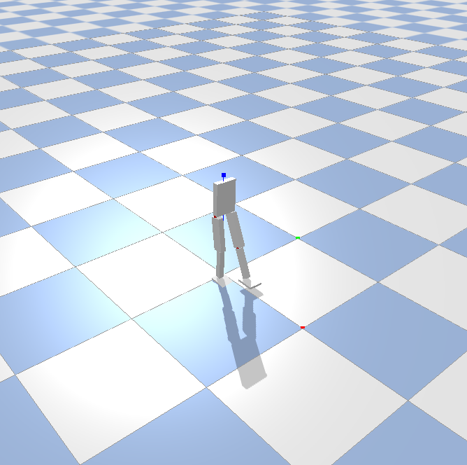

# Reninforment Learning with Bipedal Robot

## Bipedal envs in Pybullet

```
BipedalBulletEnv
|
└───BipedalBaseEnv: implementaton of step, reset, reward function
│   └───BulletBaseEnv: implementaton of render function
│  
└───BipedalRobot: implementation of 
    └───URDFBaseRobot: implementation of loading urdf, applying torques, reset simulation in Pybullet
```  

## Test
```
conda create --name <env> python=3.7
conda activate <env>
pip install -r requirements.txt
python test.py
```



## simbicon controller 

use the controller in the [refer link](https://github.com/QinjieLin-NU/Deep-Reinforcement-Learning-Algorithms/tree/master/Walker2DBulletEnv-v0_TD3) to control the robot.

```
python TD3_controller.py
```

## TD3 controller 

use the controller in the [refer link](https://github.com/Anmol6/locomotion) to control the robot

```
python simbicon_controller.py
```